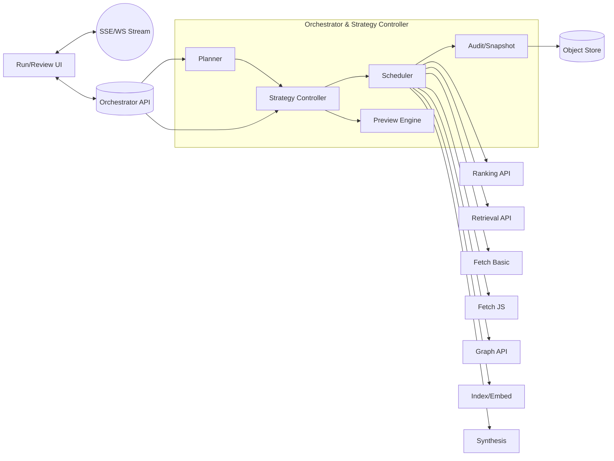

# Feature PRD — Orchestrator & Strategy Controller

**Product**: Deep Research Cockpit  
**Feature**: Orchestrator & Strategy Controller (OSC)  
**Owner**: Intelligence & Planning Team  
**Status**: Draft v1.0  
**Last Updated**: {{auto-fill on save}}

---

## Table of Contents
1. [Summary](#summary)
2. [Objectives & Success Metrics](#objectives--success-metrics)
3. [Scope & Non‑Scope](#scope--non-scope)
4. [Personas & Use Cases](#personas--use-cases)
5. [Assumptions & Dependencies](#assumptions--dependencies)
6. [Architecture & Components](#architecture--components)
7. [Functional Requirements](#functional-requirements)
8. [Non‑Functional Requirements](#non-functional-requirements)
9. [Data Model & API Contracts](#data-model--api-contracts)
10. [Algorithms & Decision Logic](#algorithms--decision-logic)
11. [Scheduling, Budgets & Policies](#scheduling-budgets--policies)
12. [Observability & Replay](#observability--replay)
13. [Security, Privacy & Compliance](#security-privacy--compliance)
14. [Acceptance Criteria & Test Plan](#acceptance-criteria--test-plan)
15. [Implementation Plan & DAG](#implementation-plan--dag)
16. [Risks & Mitigations](#risks--mitigations)
17. [Open Questions](#open-questions)
18. [Appendix A — Pseudocode](#appendix-a--pseudocode)
19. [Appendix B — Example Payloads](#appendix-b--example-payloads)

---

## Summary
The **Orchestrator & Strategy Controller (OSC)** is the central planning and control service for the Deep Research Cockpit. It decomposes a user goal into a task graph, maintains a scored **frontier** of where to explore next, and applies **strategy controls** (depth, breadth, core‑first, verify, compare, pivot) to guide exploration in real time. OSC produces a complete, auditable decision log and guarantees **deterministic replay** for after‑the‑fact analysis.

---

## Objectives & Success Metrics
### Objectives
1. Convert research goals into efficient, auditable task plans.
2. Steer exploration via live controls with immediate, predictable impact.
3. Prioritize **core‑first** sources while preserving diversity and novelty.
4. Provide full lineage for every decision (inputs → scores → actions).

### Success Metrics (P95 per Run)
- **Knob change → preview** rendered: ≤ **400 ms**.
- **Knob change → commit** (affects scheduling): ≤ **800 ms**.
- **TTFC** (Time‑to‑First‑Core L0/L1): **≥20% faster** vs baseline.
- **Evidence Robustness** (independent corroborations/claim): **≥2.0**.
- **Deterministic Replay Equivalence** on golden runs: **100%**.

---

## Scope & Non‑Scope
**In Scope**
- Planner: generates/maintains DAG of tasks (`search`, `fetch`, `extract`, `index`, `retrieve`, `synthesize`, `graph.merge`).
- Strategy Controller: computes frontier scores from **weights** (Novelty, Centrality, Disagreement, Recency, Core‑Proximity, Diversity, User‑Interest) and adjusts branching/limits.
- Commands: `depth+/-`, `breadth+/-`, `core-first on/off`, `verify`, `compare`, `pivot(topic)`, `js-policy`, `budget.update`.
- Previews & Commits: fast re‑rank previews; transactional commits with audit.
- Deterministic replay: snapshotting & seed management.

**Out of Scope**
- Rendering or scraping (delegated to Fetch services).
- Scoring individual documents (Ranking service) and content extraction (Extractor).
- UI implementation (this PRD defines the contracts the UI consumes).

---

## Personas & Use Cases
- **Research Engineer / Analyst**: steerable, auditable knowledge exploration with transparent decisioning.
- **Tech Lead / PM**: predictable cost/latency; ability to compare runs and attribute outcomes to strategy settings.
- **QA / Compliance**: deterministic replay and complete, queryable decision logs for audits.

**Representative Use Cases**
- Literature review with **core‑first** emphasis.
- Spec hunt with **Origin Trace** and contradiction discovery.
- A/B exploration: *broad survey* vs *deep verification*.

---

## Assumptions & Dependencies
**Assumptions**
- Hybrid Retrieval (OpenSearch or equivalent) and Graph Memory (Neo4j/Memgraph) are available.
- Event bus provides streaming JSONL; durable object storage persists logs and snapshots.
- Identity, authn/z, and RBAC are handled by the platform gateway.

**Dependencies**
- Fetch‑Basic, Fetch‑JS services; Ranking service; Graph service; Indexer; Synthesis; Event Store.

---

## Architecture & Components


**State**: held in a **Run Context** (in‑memory + snapshots) keyed by `run_id`. Replay loads snapshots and seeds to produce identical decisions.

---

## Functional Requirements
**OSC‑FR‑01**: Accept a goal and create an initial task graph and frontier.  
**OSC‑FR‑02**: Compute frontier scores from feature vectors and strategy weights.  
**OSC‑FR‑03**: Provide **preview** of queue/frontier changes on knob adjustments within 400 ms.  
**OSC‑FR‑04**: Commit strategy changes and reschedule tasks within 800 ms.  
**OSC‑FR‑05**: Enforce policies: branching factor, max hops, budget/time/domain caps, JS policy.  
**OSC‑FR‑06**: Emit decision events with inputs, scores, and chosen actions.  
**OSC‑FR‑07**: Support commands: `depth±`, `breadth±`, `core-first`, `verify`, `compare`, `pivot(topic)`, `js-policy`, `budget.update`.  
**OSC‑FR‑08**: Guarantee deterministic replay given identical snapshots, inputs, and seed.  
**OSC‑FR‑09**: Provide run snapshots at configurable intervals and on important transitions.  
**OSC‑FR‑10**: Expose health and metrics endpoints.

---

## Non‑Functional Requirements
- **Latency**: Preview ≤400 ms; Commit ≤800 ms (P95).
- **Throughput**: ≥100 events/sec per run sustained; ≥10 concurrent runs/node.
- **Reliability**: ≥99.5% availability; graceful degradation under dependency failures.
- **Determinism**: Bit‑for‑bit equivalence of replay on golden runs.
- **Scalability**: Horizontal scale of the scheduler and preview engine.
- **Cost**: ≤25% of run cost attributable to OSC compute.

---

## Data Model & API Contracts
### Run Context (snapshot‑able)
```json
{
  "run_id": "r-2025-10-25-01",
  "seed": 123456789,
  "goal": { "query": "...", "constraints": {"domain": ["edu","org"]} },
  "knobs": {
    "novelty": 0.5, "centrality": 0.6, "disagreement": 0.3,
    "recency": 0.4, "core_proximity": 0.8, "diversity": 0.5,
    "user_interest": 0.3, "branching_factor": 3, "max_hops": 3,
    "core_first": true, "js_policy": "auto"
  },
  "limits": { "tokens": 80000, "time_ms": 900000, "js_pct": 0.25, "domains": 50 },
  "frontier": [ {"id":"c:graphRAG","type":"concept","score":0.81, "features":{...}} ],
  "plan": { "nodes": [...], "edges": [...] },
  "overrides": { "manual_source_order": [], "pinned_concepts": ["graphRAG"] },
  "telemetry": { "counters": {}, "timers": {} },
  "rng_state": "base64..."
}
```

### Strategy Knobs
```json
{
  "novelty": 0..1,
  "centrality": 0..1,
  "disagreement": 0..1,
  "recency": 0..1,
  "core_proximity": 0..1,
  "diversity": 0..1,
  "user_interest": 0..1,
  "branching_factor": 1..10,
  "max_hops": 1..6,
  "core_first": true,
  "js_policy": "auto|conservative|aggressive"
}
```

### Frontier Item
```json
{
  "id": "c:topic-or-p:page-or:claim",
  "type": "concept|page|claim",
  "features": {
    "novelty": 0.0,
    "centrality": 0.0,
    "disagreement": 0.0,
    "recency": 0.0,
    "core_proximity": 0.0,
    "diversity": 0.0,
    "user_interest": 0.0
  },
  "score": 0.0,
  "parents": ["ids"],
  "payload": {"url": "...", "concept": "..."}
}
```

### Task Graph
```json
{
  "nodes": [
    {"id": "t1", "type": "search", "params": {"q": "..."}},
    {"id": "t2", "type": "fetch", "params": {"url": "..."}},
    {"id": "t3", "type": "extract", "params": {"mode": "claims"}}
  ],
  "edges": [
    {"from": "t1", "to": "t2"},
    {"from": "t2", "to": "t3"}
  ]
}
```

### Commands (HTTP)
- `POST /osc/runs` → create run  
  **Req** `{goal, knobs?, limits?}` → **Res** `{run_id}`
- `POST /osc/commands/{run_id}`  
  **Req** `{kind: 'depth|breadth|pivot|verify|compare|core-first|js-policy|budget.update', delta|topic|targets|value}`  
  **Res** `{ack: true, preview_id}`
- `POST /osc/preview/{run_id}`  
  **Req** `{knobs_delta}` → **Res** `{frontier_delta, queue_delta, eta_ms}`
- `POST /osc/commit/{run_id}`  
  **Req** `{preview_id}` → **Res** `{committed: true}`
- `GET /osc/frontier/{run_id}` → list frontier items
- `GET /osc/plan/{run_id}` → current task graph
- `GET /osc/snapshot/{run_id}` → latest snapshot

### Events (SSE/WS)
```json
{
  "ts": 173..., "run_id": "r-...", "step_id": "s-0032",
  "agent": "osc", "action": "decision|frontier.update|schedule",
  "input": {...}, "scores": {"novelty":0.7,...},
  "output": {"next": ["t42","t43"]},
  "cost_ms": 23, "tokens_in": 0, "tokens_out": 0,
  "reason": "core-first; low novelty; increase centrality"
}
```

---

## Algorithms & Decision Logic
### Frontier Scoring
For candidate `x` with feature vector `f`, and strategy weights `w`:

\[ \text{score}(x) = \sum_{k\in K} w_k \cdot f_k \]

Where `K = {novelty, centrality, disagreement, recency, core_proximity, diversity, user_interest}`.

**Feature computations (normalized 0..1):**
- **Novelty**: LSH/SimHash distance vs. memory & visited set.
- **Centrality**: normalized PageRank/betweenness in concept graph.
- **Disagreement**: local ratio of contradictory claims.
- **Recency**: exponential time decay of linked sources.
- **Core‑Proximity**: 1/(1+shortest citation‑path to origin) with author overlap bonus.
- **Diversity**: domain/affiliation novelty score in candidate’s neighborhood.
- **User‑Interest**: explicit pins/boosts.

**Branching & Hops**: `branching_factor` limits fan‑out per decision; `max_hops` caps distance from seeds.

### Command Semantics
- `depth+/-`: increase centrality & core_proximity; decrease branching.
- `breadth+/-`: increase novelty & diversity; increase branching.
- `core-first on/off`: gate L3/L4 in queue until L0/L1 quotas satisfied.
- `pivot(topic)`: create/boost a Concept node; add to frontier with high `user_interest`.
- `verify(targets)`: allocate budget to contradiction search near target claims.
- `compare(A,B)`: schedule differential retrieval and side‑by‑side synthesis.
- `js-policy`: set router policy; enforce %JS budget.
- `budget.update`: change tokens/time/domain/JS allocations.

### Preview Engine
- Operates on cached candidate sets and current frontier.
- Recomputes scores with modified weights; returns *deltas* only.
- No external calls; target P95 ≤400 ms.

### Deterministic Replay
- All random choices use PRNG seeded per run; RNG state is captured in snapshots.
- Priority queues are stable and tie‑broken by `(score,id)`.
- Replaying with the same inputs yields identical decisions and schedules.

---

## Scheduling, Budgets & Policies
- **Budgets**: tokens, wall‑clock, JS percentage, domain count.
- **Circuit Breakers**: abort/skip tasks when budget at risk; emit reasons.
- **Rate Limits**: per‑domain throttle (Fetch), global concurrency (Scheduler).
- **Priority**: Core‑first tasks elevated; contradiction hunts get time‑boxed slices.
- **Aging**: frontier items age to avoid starvation; penalties on stale items.

---

## Observability & Replay
- **Event Stream**: JSONL over SSE/WS for all actions and decisions.
- **Snapshots**: periodic & on transitions; include Run Context, frontier, plan, RNG state.
- **Replay Tooling**: load snapshot → re‑emit events; diff tool compares live vs replay.
- **KPIs**: TTFC, Authority Mix, Independence, Contradiction Density, Frontier Entropy, Novelty, Ops (tokens, %JS, fetch latency).

---

## Security, Privacy & Compliance
- Respect robots.txt/ToS (policy engine in Fetch layer; OSC enforces budgets/policies).
- No storage of page content within OSC; only metadata, decisions, and references.
- Secure channel to dependencies; service‑to‑service auth (mTLS/JWT).
- Audit logs immutable; configurable retention; PII minimization.

---

## Acceptance Criteria & Test Plan
**AC‑1**: Knob change produces preview delta in ≤400 ms (P95).  
**AC‑2**: Commit applies scheduling changes in ≤800 ms (P95).  
**AC‑3**: Deterministic replay reproduces event sequence exactly on golden runs.  
**AC‑4**: Budget guardrails prevent exceeding configured caps.  
**AC‑5**: Commands (`depth`, `breadth`, `pivot`, `verify`, `compare`, `core-first`, `js-policy`) alter frontier/queue as specified.

**Tests**
- Unit: scoring normalization; command transformation; preview deltas.
- Property‑based: determinism under permutations of equal‑score items.
- Integration: end‑to‑end with mocked dependencies.
- Load: concurrent runs with heavy event throughput.
- Golden Runs: fixed seeds/inputs; bit‑for‑bit event equality.

---

## Implementation Plan & DAG
1. **Event Schema & Bus** → stream endpoints; validators.
2. **Run Context & Snapshots** → serialization; RNG state capture.
3. **Planner Skeleton** → initial seeds; plan updates.
4. **Frontier & Scoring** → feature adapters; stable PQ.
5. **Command Handlers** → knob deltas; gate policies.
6. **Preview Engine** → delta computation; UI payloads.
7. **Scheduler** → ready queues; budget enforcement; rate limits.
8. **Replay Mode Support** → snapshot loader; event re‑emitter.
9. **Metrics & Health** → KPIs; Prometheus; tracing.

**Exit Criteria (Feature‑Complete)**
- All Acceptance Criteria met; golden runs stable; dashboards populated.

---

## Risks & Mitigations
- **Over‑reactive Strategy**: Thrashing between breadth and depth → hysteresis & cooldown windows on knob changes.
- **Starvation**: High core‑proximity traps exploration → aging & diversity floors.
- **Cost Spikes**: Overuse of JS path → JS % budget caps; router tuning.
- **Replay Drift**: Hidden nondeterminism → strict seeding; deterministic dependencies; tie‑breakers.

---

## Open Questions
1. Do we expose per‑cluster weight presets beyond macros (e.g., *Video‑first*, *Spec Hunt*)?  
2. Should contradictions trigger automatic *mini‑runs* with isolated budgets?  
3. What is the default snapshot cadence (time‑based vs event‑based thresholds)?

---

## Appendix A — Pseudocode
```python
@dataclass
class StrategyKnobs:
    novelty: float; centrality: float; disagreement: float
    recency: float; core_proximity: float; diversity: float
    user_interest: float; branching_factor: int; max_hops: int
    core_first: bool; js_policy: str

@dataclass
class FrontierItem:
    id: str; type: str; features: Dict[str,float]; score: float; parents: List[str]; payload: Dict

class Orchestrator:
    def score(self, item: FrontierItem, knobs: StrategyKnobs) -> float:
        w = knobs.__dict__
        f = item.features
        s = sum(w[k]*f.get(k,0.0) for k in (
            'novelty','centrality','disagreement','recency',
            'core_proximity','diversity','user_interest'))
        return s

    def preview(self, ctx: RunContext, delta: Dict[str,Any]) -> Preview:
        k2 = apply_delta(copy(ctx.knobs), delta)
        for it in ctx.frontier: it.score = self.score(it, k2)
        return compute_deltas(ctx.frontier)

    def commit(self, ctx: RunContext, preview: Preview):
        apply_preview(ctx, preview)
        schedule_next(ctx)
```

---

## Appendix B — Example Payloads
**Command (breadth+)**
```json
{
  "kind": "breadth",
  "delta": +1,
  "reason": "Cluster homogeneity too high; increase domain diversity"
}
```

**Decision Event**
```json
{
  "ts": 1730045678123,
  "run_id": "r-001",
  "step_id": "s-0042",
  "agent": "osc",
  "action": "frontier.update",
  "input": {"delta": {"breadth": +1}},
  "scores": {"novelty": 0.72, "diversity": 0.65, "core_proximity": 0.41},
  "output": {"next": ["t-93","t-94"], "branching_factor": 4},
  "reason": "Breadth increased; selecting high-novelty, independent domains"
}
```

