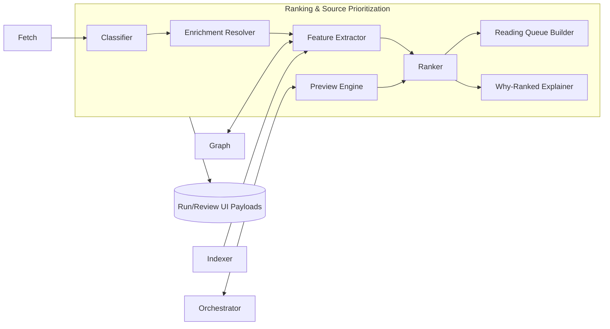

# Feature PRD — Ranking & Source Prioritization

**Product**: Deep Research Cockpit  
**Feature**: Ranking & Source Prioritization (RSP)  
**Owner**: Intelligence & Retrieval Team  
**Status**: Draft v1.0  
**Last Updated**: {{auto-fill on save}}

---

## Table of Contents
1. [Summary](#summary)
2. [Objectives & Success Metrics](#objectives--success-metrics)
3. [Scope & Non‑Scope](#scope--non-scope)
4. [Personas & Use Cases](#personas--use-cases)
5. [Assumptions & Dependencies](#assumptions--dependencies)
6. [Architecture & Components](#architecture--components)
7. [Functional Requirements](#functional-requirements)
8. [Non‑Functional Requirements](#non-functional-requirements)
9. [Source Taxonomy & Reading Order](#source-taxonomy--reading-order)
10. [Signals & Features](#signals--features)
11. [Ranking Algorithms & Decision Logic](#ranking-algorithms--decision-logic)
12. [Reading Queue Builder](#reading-queue-builder)
13. [Data Model & API Contracts](#data-model--api-contracts)
14. [Observability & "Why‑Ranked"](#observability--why-ranked)
15. [Scheduling, Costs & Policies](#scheduling-costs--policies)
16. [Acceptance Criteria & Test Plan](#acceptance-criteria--test-plan)
17. [Implementation Plan & DAG](#implementation-plan--dag)
18. [Risks & Mitigations](#risks--mitigations)
19. [Open Questions](#open-questions)
20. [Appendix A — Pseudocode](#appendix-a--pseudocode)
21. [Appendix B — Example Payloads](#appendix-b--example-payloads)
22. [Appendix C — Default Weights & Boosts](#appendix-c--default-weights--boosts)

---

## Summary
The **Ranking & Source Prioritization (RSP)** feature orders candidate sources and assembles a **core‑first reading queue** that privileges primary artifacts (papers/specs/repos) and influential syntheses before expository blogs and forums. RSP integrates textual relevance (hybrid retrieval), **authority** (citations, venue, DOI, OA status), **core proximity** (citation‑graph distance to origin works), **recency**, and **independence/diversity**. It produces transparent **why‑ranked** explanations and supports **what‑if previews** driven by the Orchestrator’s strategy knobs.

---

## Objectives & Success Metrics
### Objectives
1. Prioritize sources that are **closest to the core** (papers/specs/repos by original authors) while maintaining domain diversity.
2. Provide **transparent, auditable** ranking rationales and deltas under strategy changes.
3. Construct a **layered reading queue** (L0→L4) with gap detection and core‑first gating.
4. Operate within strict latency and cost budgets; degrade gracefully under rate limits.

### Success Metrics (P95 unless noted)
- **Time‑to‑First‑Core (TTFC)** improved ≥ **20%** vs. baseline ranking.
- **Authority Mix**: ≥ **60%** of consumed items in L0/L1 under core‑first mode.
- **Why‑ranked Coverage**: 100% of surfaced items include factor breakdowns.
- **Enrichment Latency**: metadata enrichment ≤ **1.5s** (batched) for new items.
- **Recall@k (RAGAS/bench)**: +**10%** vs lexical‑only baseline for core queries.

---

## Scope & Non‑Scope
**In Scope**
- Source classification and enrichment (papers/specs/repos/official docs/blogs/videos/forums).
- Feature extraction (text relevance, authority, proximity, recency, independence, penalties).
- Score computation and **why‑ranked** explanations.
- Reading queue construction with L0→L4 quotas and gap detection.
- What‑if re‑rank previews for strategy changes.

**Out of Scope**
- Content fetching/rendering (Fetch services own that).
- Concept graph storage (Graph service) and synthesis.
- UI implementation (RSP provides payloads for UI).

---

## Personas & Use Cases
- **Research Engineer/Analyst**: Wants the paper/spec first, then the definitive talk, then concise explainers.
- **Tech Lead/PM**: Needs confidence in provenance and a defensible reading order.
- **Compliance/QA**: Requires traceability (retraction flags, venue quality) and logs.

**Use Cases**
- Literature review with **core‑first** emphasis.
- Spec hunt with author repo > third‑party tutorial.
- Controversy scan with explicit **contradiction‑aware** ranking.

---

## Assumptions & Dependencies
**Assumptions**
- Hybrid index available (BM25 + dense vectors; neural sparse optional).
- Citation/venue metadata available via OpenAlex/Semantic Scholar; DOI resolution via Crossref; OA via Unpaywall; venue quality (e.g., CORE rankings); YouTube caption access.

**Dependencies**
- Fetch Basic/JS → HTML/MD + basic metadata.
- Graph service → origin set and citation distances; affiliation/domain diversity.
- Orchestrator → strategy knobs, what‑if requests, commit triggers.
- Indexer → embeddings and lexical scores.

---

## Architecture & Components


---

## Functional Requirements
**RSP‑FR‑01**: Classify each candidate into a source type (paper, spec/standard, official repo/docs, author survey/tutorial, influential blog, video, StackOverflow/MathOverflow, vendor/forum, news).

**RSP‑FR‑02**: Enrich with external metadata: DOI, venue, citation counts/velocity, OA link, Crossmark/retraction, author IDs, affiliations, repository ownership, caption availability.

**RSP‑FR‑03**: Compute feature vector per candidate: text relevance (hybrid), authority, core proximity, recency, independence/diversity, content quality, penalties.

**RSP‑FR‑04**: Produce a normalized score and **why‑ranked** breakdown with per‑factor contributions.

**RSP‑FR‑05**: Build a **reading queue** with L0→L4 buckets and quotas; support core‑first gating and “gaps” identification (e.g., missing spec).

**RSP‑FR‑06**: Support **what‑if** previews for knob deltas; return re‑rank deltas without side effects.

**RSP‑FR‑07**: Deduplicate near‑duplicates via SimHash/MinHash; prefer OA PDFs and canonical copies.

**RSP‑FR‑08**: Provide **video scoring** (speaker match, caption quality) and timestamped transcript snippets when available.

**RSP‑FR‑09**: Respect budgets and rate limits; cache enrichment results; degrade gracefully.

---

## Non‑Functional Requirements
- **Latency**: Rank top‑N with enrichment cache hits ≤ **400 ms**; with fresh enrichment ≤ **1.5 s** (batched).
- **Throughput**: ≥ **200** candidates/sec per node for scoring/explanations.
- **Availability**: ≥ **99.5%**; clear partial‑results semantics.
- **Determinism**: Stable sort with tie‑breakers `(score,type_boost,id)`.
- **Cost**: Enrichment API calls amortized via caches (hit rate ≥ **80%** steady state).

---

## Source Taxonomy & Reading Order
**L0 — Primary Artifacts**: peer‑reviewed papers (DOI), canonical specs/standards (RFC, W3C, ISO), official repos, datasets, *formal errata/retractions*.

**L1 — Influential Syntheses**: survey/tutorial papers in reputable venues; seminal author blogs/whitepapers.

**L2 — "Watch the Act"**: conference talks/keynotes/demos by original authors/maintainers with captioned transcripts.

**L3 — Expository Explainers**: technical blogs, high‑quality docs, academically minded write‑ups.

**L4 — Practitioner Discussions**: MathOverflow/StackOverflow; vendor/community support forums; GitHub Discussions.

**Order Rule**: Queue is filled L0→L4; **core‑first** gate delays L3/L4 until L0/L1 quotas are satisfied or explicitly overridden. Gaps are surfaced to the Orchestrator to continue searching.

---

## Signals & Features
**Text Relevance (0..1)**
- Hybrid score: RRF over BM25, dense vector cosine, optional neural sparse; length‑normalized.

**Authority (0..1)**
- DOI present/resolvable; venue quality (A*/A/B); citation counts and velocity; OA link existence; author reputation; Crossmark status (concern/retraction), publisher reliability.

**Core Proximity (0..1)**
- 1/(1 + shortest citation‑path to any **origin** source) with bonuses for author/affiliation overlap; repository/spec ownership by origin institution.

**Recency (−1..+1)**
- Topic‑specific half‑life decay; negative if superseded/corrected; boost for recent authoritative addenda.

**Independence & Diversity (0..1)**
- Cross‑domain/affiliation independence vs origin cluster; penalize tight echo chambers; prefer corroboration from distinct sources.

**Content Quality (0..1)**
- Readability; main‑content density; code block presence for repos/specs; caption availability for videos.

**Penalties**
- Retraction/concern; paywall without OA; excessive duplication; spam signals.

---

## Ranking Algorithms & Decision Logic
### Global Score
For candidate *d* and query/strategy context:

```
Rank(d) =  α * TextRel(d) + β * Authority(d) + γ * CoreProx(d)
         + δ * Recency(d) + ε * Independence(d) + θ * ContentQ(d)
         + BaseBoost(type(d)) - ζ * Penalty(d)
```

**Defaults (tunable by Orchestrator)**
- α=0.35, β=0.25, γ=0.25, δ=0.10, ε=0.07, θ=0.03, ζ=1.00
- Type base boosts defined in [Appendix C](#appendix-c--default-weights--boosts)

**Mode Presets**
- *Core‑First*: ↑β, ↑γ; L3/L4 cap until quotas hit.
- *Broad Survey*: ↑ε, mild ↑α; diversity floors per domain.
- *Verification*: ↑ε (independent corroboration) and contradiction hunt bias.
- *Video‑First*: ↑θ for captioned videos from origin authors.

**RRF Hybrid Relevance**
- RRF@k over normalized BM25, dense, and (opt) neural sparse: `1/(k + rank_i)` sum.

**Authority**
- Composite of: DOI (+), venue rank (+), citations percentile (+), OA (+), Crossmark concern (−), retraction (−−), author reputation (+).

**Core Proximity**
- Graph shortest path length to origin; +0.1 author overlap; +0.1 origin‑owned repo/spec.

**Recency**
- Exponential decay with topic half‑life; floor for seminal works; suppress if superseded.

**Independence**
- JS divergence of domain/affiliation distribution vs origin cluster; encourage independent corroboration.

**Penalties**
- Retraction=1.0; Concern=0.5; Hard demotion but visible.

**Ties**
- Stable by `(score desc, type_boost desc, published_at desc, url hash asc)`.

---

## Reading Queue Builder
**Inputs**: top‑N ranked candidates; **origin set**; strategy; quotas per layer.

**Algorithm**
1. Identify **origin set** (earliest high‑impact works/specs/repos) using citations/time thresholds.
2. Assign **type** and compute **layer** (L0..L4).
3. Fill queue in order L0→L4 with quotas (e.g., L0≤5, L1≤3, L2≤2, L3≤3, L4≤3).
4. Mark **gaps** (e.g., “spec missing”) → signal Orchestrator to continue hunting.
5. Apply **core‑first gate** until L0/L1 quotas satisfied unless overridden.
6. Deduplicate near‑duplicates; prefer OA PDFs and canonical repos.
7. Attach **action hints**: Open PDF, Best OA, Watch with timestamps, Read.

**Outputs**
- Structured queue with **why‑ranked** and **action hints** per item; “gaps” list.

---

## Data Model & API Contracts
### SourceProfile (normalized)
```json
{
  "url": "https://...",
  "type": "paper|spec|repo|official-doc|author-survey|blog|video|stackoverflow|mathoverflow|forum|news",
  "title": "...",
  "published_at": "2024-06-01",
  "doi": "10.xxxx/...",
  "venue": { "name": "ICML", "rank": "A*" },
  "authors": [{"id":"A123","name":"...","aff":"..."}],
  "citations": { "count": 213, "velocity": 1.7 },
  "oa": { "is_oa": true, "best_pdf": "https://..." },
  "crossmark": { "retracted": false, "concern": false },
  "video": { "has_captions": true, "speaker_match": 0.82 },
  "forum": { "site": "mathoverflow", "score": 47, "accepted": true },
  "domain": "example.edu",
  "affiliations": ["Univ X", "Lab Y"],
  "text_rel": 0.82,
  "graph": { "min_path_to_origin": 1, "origin_overlap": 0.1 },
  "content_q": 0.66,
  "penalties": { "retraction": 0, "paywalled": 0 }
}
```

### RankBreakdown
```json
{
  "score": 0.87,
  "factors": {
    "text_rel": 0.29,
    "authority": 0.22,
    "core_prox": 0.23,
    "recency": 0.06,
    "independence": 0.04,
    "content_q": 0.03,
    "type_boost": 0.08,
    "penalties": -0.08
  },
  "mode": "core-first",
  "notes": ["DOI resolved", "OA PDF found", "Path length=1 to origin Smith 2019"]
}
```

### APIs (HTTP/JSON)
- `POST /rsp/classify` → `{profiles:[{url,type}]}`
- `POST /rsp/enrich` → `{profiles:[SourceProfile...]}`
- `POST /rsp/score` → `{scores:[{url,score,breakdown:RankBreakdown}]}`
- `POST /rsp/queue/build` → `{L0:[...],L1:[...],L2:[...],L3:[...],L4:[...],gaps:[...]} `
- `POST /rsp/preview` → `{delta:{weights|mode}, deltas:{ranked_diff:[...]}}`

**Events (for observability)**
- `rsp.rank` (inputs, weights, top‑k with breakdowns)
- `rsp.queue` (final queue + gaps)
- `rsp.preview` (before/after positions and reasons)

---

## Observability & "Why‑Ranked"
- Every item includes a factor stack with contributions and citations (e.g., DOI, venue, OA, path length, retraction status).
- **Reason cards**: compact human‑readable bullets; link back to enrichment records.
- **Preview**: “ghost bars” showing score changes under alternate weights.
- Audit log includes inputs, weights, candidate set hash, and stable sort keys.

---

## Scheduling, Costs & Policies
- Batch enrichment by domain/provider; cache results with TTL; respect provider rate limits.
- Enforce **OA preference** when toggled; suppress L4 under core‑first until quotas met.
- Apply **domain diversity floors** in Broad Survey mode.
- JS budget respected via Orchestrator; RSP abstains from fetch decisions.

---

## Acceptance Criteria & Test Plan
**AC‑1**: Ranking returns top‑N with complete **why‑ranked** within SLA.  
**AC‑2**: Core‑first mode yields ≥60% L0/L1 in consumed set for benchmark tasks.  
**AC‑3**: What‑if preview returns consistent deltas with no side effects.  
**AC‑4**: Retraction/concern items are always demoted and visibly flagged.  
**AC‑5**: Reading queue flags gaps correctly and respects quotas/gates.  
**AC‑6**: Deterministic ordering for ties across repeated runs.

**Tests**
- Unit: scoring composition, normalization, penalties, tie‑breaking.
- Integration: enrichment adapters (OpenAlex, Crossref, S2, Unpaywall, CORE, YouTube captions).
- A/B: hybrid vs lexical‑only; mode presets.
- Golden sets: expected top‑k per topic with source justifications.
- Load: 10k candidates scoring with cache hit/miss mix.

---

## Implementation Plan & DAG
1. **Schema & Contracts** → SourceProfile, RankBreakdown, Queue API.
2. **Classifier** → heuristics + simple ML model for type detection.
3. **Enrichment Resolver** → provider clients + caches + retry/backoff.
4. **Feature Extractor** → compute text_rel, authority, proximity, recency, independence, content_q, penalties.
5. **Ranker** → scoring function, stable sort, mode presets; **Why‑Ranked** composer.
6. **Queue Builder** → L0→L4 quotas, gaps, OA preference, dedup.
7. **Preview Engine** → re‑rank on cached set; delta computation.
8. **Observability** → events; reason cards payloads; metrics.
9. **Hardening** → rate limits, circuit breakers, golden tests.

**Exit Criteria (Feature‑Complete)**
- All Acceptance Criteria met; dashboards reflect Authority Mix, TTFC deltas.

---

## Risks & Mitigations
- **Provider Rate Limits** → caching, batching, exponential backoff, offline sync jobs.
- **Authority Bias** → independence/diversity term; domain/affiliation floors.
- **Nascent Topics (low citations)** → venue/author priors; repo/spec ownership boost.
- **Data Quality Drift** → periodic re‑enrichment; stale cache eviction; integrity checks.
- **Latency Spikes** → progressive results; partial rankings with enrichment retries.

---

## Open Questions
1. Should we persist per‑topic **half‑life** configs (recency) in the graph or a separate table?  
2. Do we allow user‑defined **venue whitelists/blacklists** beyond CORE ranks?  
3. What k for RRF’s cutoff balances stability vs responsiveness under previews?

---

## Appendix A — Pseudocode
```python
@dataclass
class Weights:
    alpha: float=0.35; beta: float=0.25; gamma: float=0.25
    delta: float=0.10; eps: float=0.07; theta: float=0.03; zeta: float=1.0

TYPE_BOOST = {
  'paper': 0.30, 'spec': 0.30, 'repo': 0.25, 'official-doc': 0.25,
  'author-survey': 0.20, 'video': 0.15, 'blog': 0.10,
  'mathoverflow': 0.07, 'stackoverflow': 0.05, 'forum': 0.02, 'news': 0.05
}

@dataclass
class SourceProfile:
    url: str; type: str; text_rel: float; authority: float; core_prox: float
    recency: float; independence: float; content_q: float; penalty: float
    published_at: Optional[str] = None

def rank(p: SourceProfile, w: Weights) -> float:
    base = TYPE_BOOST.get(p.type, 0.0)
    s = (w.alpha*p.text_rel + w.beta*p.authority + w.gamma*p.core_prox +
         w.delta*p.recency + w.eps*p.independence + w.theta*p.content_q +
         base - w.zeta*p.penalty)
    return s
```

---

## Appendix B — Example Payloads
**/rsp/score (response item)**
```json
{
  "url": "https://arxiv.org/abs/xxxx",
  "score": 0.904,
  "breakdown": {
    "text_rel": 0.31,
    "authority": 0.21,
    "core_prox": 0.24,
    "recency": 0.05,
    "independence": 0.04,
    "content_q": 0.03,
    "type_boost": 0.08,
    "penalties": -0.02
  },
  "layer": "L0",
  "why": [
    "DOI resolved; OA PDF available",
    "Short path to origin (1 hop) with author overlap",
    "Venue=A*; citations=213; Crossmark clean"
  ]
}
```

**/rsp/queue/build (response)**
```json
{
  "L0": [ {"url": "...", "score": 0.90, "action": "open_pdf" } ],
  "L1": [ {"url": "...", "score": 0.82, "action": "read" } ],
  "L2": [ {"url": "...", "score": 0.73, "action": "watch", "timestamps": [120, 845]} ],
  "L3": [ {"url": "...", "score": 0.66 } ],
  "L4": [ {"url": "...", "score": 0.58 } ],
  "gaps": ["spec missing", "no official repo"]
}
```

**/rsp/preview (response)**
```json
{
  "delta": {"mode": "core-first", "weights": {"beta": +0.05, "gamma": +0.05}},
  "ranked_diff": [
    {"url": "paperA", "from": 5, "to": 1, "reason": "+authority,+core_prox"},
    {"url": "blogB",  "from": 2, "to": 7, "reason": "type cap under core-first"}
  ]
}
```

---

## Appendix C — Default Weights & Boosts
**Type Base Boosts**

| Type              | Boost |
|-------------------|:-----:|
| Paper (peer‑rev.) | +0.30 |
| Spec/Standard     | +0.30 |
| Official Repo/Doc | +0.25 |
| Author Survey     | +0.20 |
| Video (author)    | +0.15 |
| High‑quality Blog | +0.10 |
| MathOverflow      | +0.07 |
| StackOverflow     | +0.05 |
| Forum             | +0.02 |
| News              | +0.05 |

**Mode Presets**
- **Core‑First**: `beta+=0.05, gamma+=0.05; gate L3/L4 until quotas`.
- **Broad Survey**: `eps+=0.06, alpha+=0.04; domain diversity floor=0.5`.
- **Verification**: `eps+=0.08; emphasize independent corroboration; contradiction boost`.
- **Video‑First**: `theta+=0.06; require captions & speaker_match>=0.7`.

